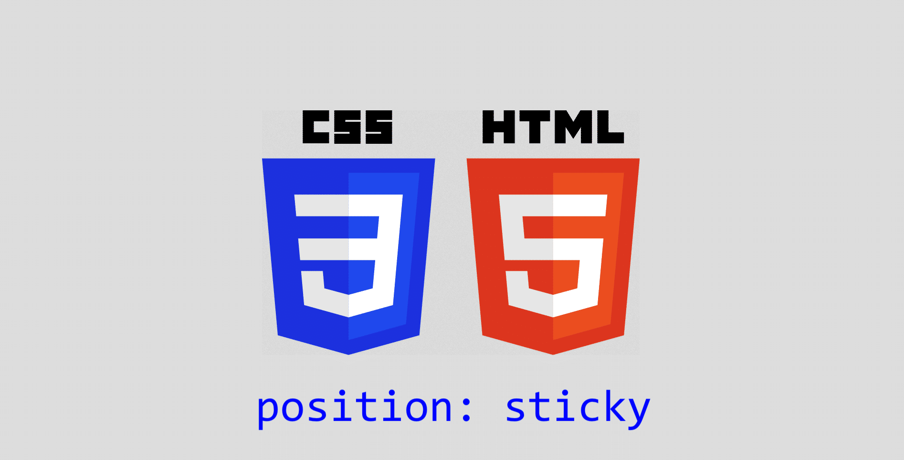
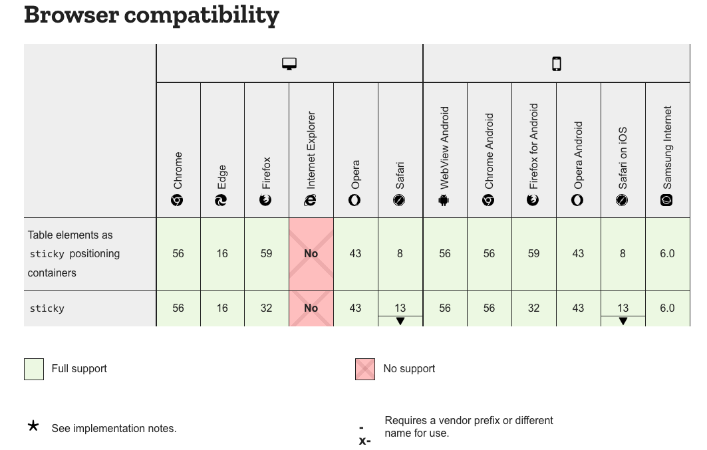
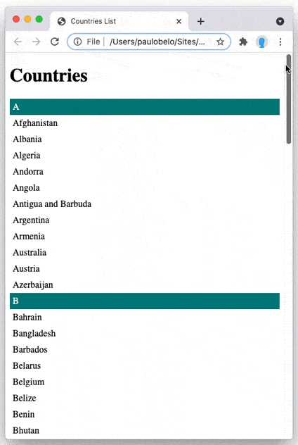
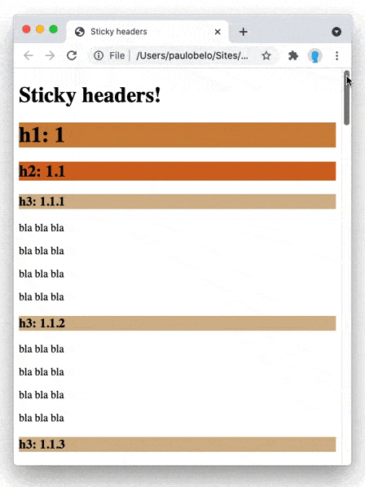
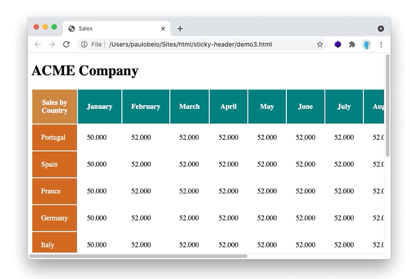

# Creating a list or table sticky header

## Using CSS position: sticky




In this article we'll see how to create list and table sticky headers using only CSS.

Recently I needed to create a sticky header, so I searched for the best way to do it. I read many articles and posts, but it was not easy to find updated and clear information about this subject, mainly because recent updates to browsers compatibility make many articles outdated. So I'll share what I've learned with you, including some demos I've built to test the concepts.

If you just want to grab the code, skip to "Live demo, code and fiddle" section.

### Browser compatibility




Until recently javascript was frequently used to create sticky headers, because CSS "`position: sticky`" was in "experimental mode", meaning that it would not work on most browsers.

But at this moment 95% of browsers are compatible with it (according to Can I Use [1]), so it means it can be used with confidence.

A polyfill could be used to cover the remaining cases. Stickyfill [2] a project with 2.2k stars on github has gone into "Unmaintained" mode because, as they say, "Stickyfill did a good job while the browsers were implementing position: sticky support. You can now safely use stickies without a polyfill, all modern browsers support them natively.".

So let's see what `position: sticky` is and how we can use it.


### CSS position: sticky

According to MDN Web Docs [3], [4]:

> A stickily positioned element is an element whose computed position value is sticky. It's treated as relatively positioned until its containing block crosses a specified threshold (such as setting top to value other than auto) within its flow root (or the container it scrolls within), at which point it is treated as "stuck" until meeting the opposite edge of its containing block.

So, this means the element is positioned according to the normal flow of the document, and then offset relative to its nearest scrolling ancestor and containing block (nearest block-level ancestor [5]), including table-related elements, based on the values of top, right, bottom, and left.

In W3C CSS Positioned Layout Module specification [6] you can read:

> Sticky positioning is similar to relative positioning except the offsets are automatically calculated in reference to the nearest scrollport. For a sticky positioned box, the inset properties represent insets from the respective edges of the nearest scrollport, defining the sticky view rectangle used to constrain the box’s position.

Let's see how we can aply these concepts:

### Demo 1: List sticky header




In this demo we create a class ("sticky") and define the position sticky related to the top, with a margin of 0px.

```css
.sticky {
    position: sticky;
    position: -webkit-sticky;
    top: 0px;
}
```

`-webkit-sticky` is used for compatibility with older versions of Safari and other WebKit based browsers[7].

We then aply this class to the elements we want to be "sticky":


```html
<div class="sticky">A</div>
<ul>
    <li>Afghanistan</li>
    <li>Albania</li>
    <li>Algeria</li>

(...)

<div class="sticky">B</div>
<ul>
    <li>Bahrain</li>
    <li>Bangladesh</li>
    <li>Barbados</li>

```


### Demo 2: Multi section sticky headers



In this case we have three different classes, each one with a different top position. This means that the elements that belong to these classes will "stick" at different positions, causing the "sub-folder" effect.

```css
.sticky1 {
position: sticky;
position: -webkit-sticky;  /* Safari */
top: 0px;
background-color: peru;
}
.sticky2 {
position: sticky;
position: -webkit-sticky;
top: 37px;
background-color: chocolate;
}
.sticky3 {
position: sticky;
position: -webkit-sticky;
top: 65px;
background-color: tan;
}
```

And apply each class to the respective HTML element:

```html
<h1 class="sticky1">h1: 1</h1>
<h2 class="sticky2">h2: 1.1</h2>
<h3 class="sticky3">h3: 1.1.1</h3>
<p>bla bla bla</p>
<p>bla bla bla</p>
```

One problem with this approach is that because you are using pixel units, if you have any changes on screen or font pixel dimensions it will cause overlaps or extra spacing. This can also occur with responsive layout if one title overflows to two (or more) lines. So use it with caution :)


### Demo 3: Table columns and rows sticky headers



In this demo we have a table with rows and columns sticky headers. So we'll create three CSS classes:


`.sticky-top` will be aligned to top with 0px, and z-index 1 so text will scroll under it.

`.sticky-left` aligned to left with 0px and z-index 1.

`.sticky-top-left` aligned to top with 0px and to left with 0px and z-indedx 2 so text and other headers will scroll under it.

The complete CSS code will look like:

```css
.sticky-top {
    position: sticky;
    position: -webkit-sticky;
    top: 0px;
    z-index: 1;
    /* set some style (optional)*/
    background-color: teal;
    color: white;
}

.sticky-left {
    position: sticky;
    position: -webkit-sticky;
    left: 0px;
    z-index: 1;
    /* set some style (optional)*/
    background-color: chocolate;
    color: white;
}

.sticky-top-left {
    position: sticky;
    position: -webkit-sticky;
    top: 0px;
    left: 0px;
    z-index: 2;
    /* set some style (optional)*/
    background-color: peru;
    color: white;
}

/* set some spacing (optional)*/
td, 
th {
    padding: 20px;
}

```

These classes will be applied to HTML elements like this:

```html
<table>
    <tr>
        <th class="sticky-top-left">Sales by Country</th>
        <th class="sticky-top">January</th>
        <th class="sticky-top">February</th>
        <th class="sticky-top">March</th>
(...)
    <tr>
        <td class="sticky-left">Portugal</td>
        <td>50.000</td>
        <td>52.000</td>
        <td>52.000</td>
(...)
```


Demo 4 will have the same exact output, but instead of using classes, CSS will apply styling to the HTML elements. So this is an alternative to the previous demo. You can use it according to your preferences and/or context.


```css
/* style columns table headings*/
th[scope=col]  {
position: -webkit-sticky;
position: sticky;
top: 0;
z-index: 1;
background-color: teal;
}

/* style columns headings first element*/
th[scope=col]:nth-of-type(1)  {
position: -webkit-sticky;
position: sticky;
top: 0;
left: 0;
z-index: 2;
background-color: peru;
}

/* style rows table headings*/
th[scope=row] {
position: -webkit-sticky;
position: sticky;
left: 0;
z-index: 1;
background-color: chocolate;
}
```

and HTML elements will be like:

```html
<table>
    <tr>
        <th scope="col">Sales by Country</th>
        <th scope="col">January</th>
        <th scope="col">February</th>
        <th scope="col">March</th>
(...)
    <tr>
        <th scope="row">Portugal</th>
        <td>50.000</td>
        <td>52.000</td>
        <td>52.000</td>
(...)
```


### Known issues

Currently the position:sticky element exclusively works when all of general parents are overflow:visible.

You can read more about this at GitHub issues[8] and test it in Robert Utasi's fiddle[9].


### Live demo, code and fiddle

Live demo (GitHub Pages) at:

https://pjbelo.github.io/sticky-headers/


Complete code (GitHub) at:

https://github.com/pjbelo/sticky-headers


Code playground (jsfiddle) at:

[Sticky headers - Demo 1](https://jsfiddle.net/pjbelo/xL90a5u2/2)

[Sticky headers - Demo 2](https://jsfiddle.net/pjbelo/m5u0g32s/3/)

[Sticky headers - Demo 3](https://jsfiddle.net/pjbelo/u9qkebx0/3/)

[Sticky headers - Demo 4](https://jsfiddle.net/pjbelo/u5npw6yL/2/)

### References

[1] https://caniuse.com/css-sticky

[2] https://github.com/wilddeer/stickyfill

[3] https://developer.mozilla.org/en-US/docs/Web/CSS/position#sticky_positioning

[4] https://developer.mozilla.org/en-US/docs/Learn/CSS/CSS_layout/Positioning#position_sticky

[5] https://developer.mozilla.org/en-US/docs/Web/HTML/Block-level_elements#elements

[6] https://drafts.csswg.org/css-position-3/#stickypos-insets

[7] https://webkit.org/status/#feature-position:-sticky

[8] https://github.com/w3c/csswg-drafts/issues/865

[9] https://jsfiddle.net/utasir/rmmkxq62/11/

